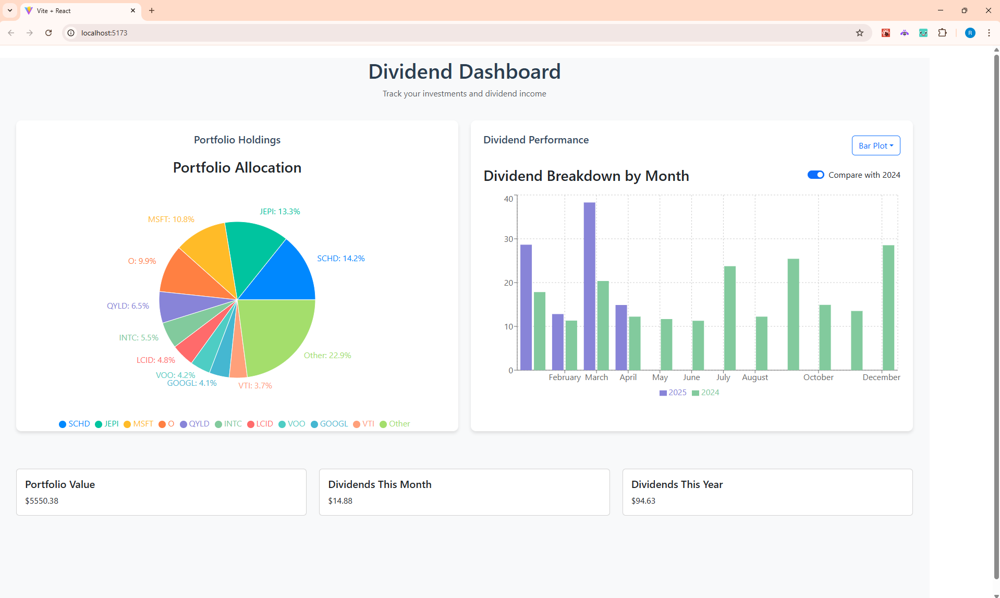

# Portfolio Dashboard

A comprehensive web dashboard built to visualize and analyze an investment portfolio, leveraging data from Robinhood and presenting insights using React and Flask.

## Example View

## 🌟 Features

- **Portfolio Allocation Pie Chart**: Get a quick snapshot of the distribution of your investments across various assets (hover for additional data).
- **Dividend Analysis** (hover for additional data):
  - **Bar Chart**: Visualize overall yearly dividends with a breakdown showing contributions by Month.
  - **Scatter Plot**: Observe total dividends received each month.
  - **Line Graph**: Track the trend of total dividends over time.
  - **Compare to Previous Year**: Toggle this option to comparatively visualize changes between Years
- **Interactive Elements**: Switch between different visual representations (Bar, Scatter, Line) for dividend analysis.
- **Portfolio & Dividend Metrics**: Quick metrics showing current portfolio value and dividends received for the current month/year.

## 🛠️ Tech Stack

- **Backend:**

  - **robin_stocks**: Fetch and process portfolio data from Robinhood.
  - **pandas**: Data manipulation and analysis.
  - **Flask**: Create API for frontend to communicate with

- **Frontend**:

  - **React**: Create the web application layout and interactive elements.

## 🚀 Getting Started

**Prerequisites**

1. Python 3.x
2. Pip
3. Robinhood Account

**Setup**

1. Clone the repository:

`git clone <repository_url>`

2. Navigate to the project directory and install the required Python packages:

`pip install -r requirements.txt`

3. Save your Robinhood credentials in RHCredentials.txt or directly in the code (not recommended for security reasons).

## Running the App

1. In the terminal, navigate to the project directory.

2. Navigate to Server folder and run the Flask Server:

`python <main>.py`

3. Navigate to the RH_Dashboard folder and run the frontend:
   `npm run dev`

4. Open a web browser and navigate to http://127.0.0.1:5173/ (or whichever port your computer is running the application on) to access the dashboard.

## 🌱 Future Enhancements

- Add more metrics like performance comparison to benchmark indices.
- Implement security features for safer login.
- Extend to support multiple brokerage accounts.

## 🤝 Contributing

If you'd like to contribute, please fork the repository and use a feature branch. Pull requests are warmly welcome.

## NOTES

NOTE: Changes to Authentication.py in the robin_stocks package -> Robinhood -> authentication.py were made in accordance to: https://github.com/bhyman67/Mods-to-robin-stocks-Authentication/commit/02e5491a9844382c5915180b7bd5321ed98a013b

At the time of this upload (4/15/2025), the default authentication.py is not maintained and will not successfully authenticate
