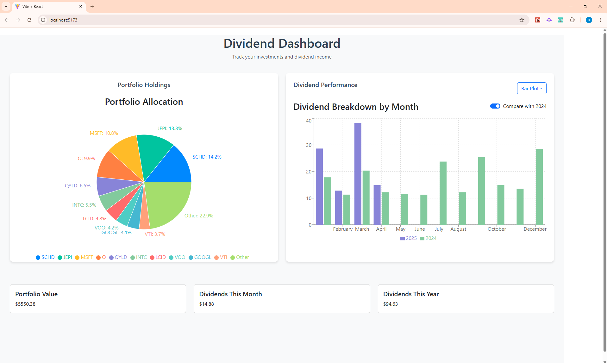

# Portfolio Dashboard

A comprehensive web dashboard built to visualize and analyze an investment portfolio, leveraging data from Robinhood and presenting insights using React and Flask.

## Example View



## 🌟 Features

- **Portfolio Allocation Pie Chart**: Get a quick snapshot of the distribution of your investments across various assets (hover for additional data).
- **Dividend Analysis** (hover for additional data):
  - **Bar Chart**: Visualize overall yearly dividends with a breakdown showing contributions by Month.
  - **Scatter Plot**: Observe total dividends received each month.
  - **Line Graph**: Track the trend of total dividends over time.
  - **Compare to Previous Year**: Toggle this option to comparatively visualize changes between Years
- **Interactive Elements**: Switch between different visual representations (Bar, Scatter, Line) for dividend analysis.
- **Portfolio & Dividend Metrics**: Quick metrics showing current portfolio value and dividends received for the current month/year.

## 🛠️ Tech Stack

- **Backend:**

  - **robin_stocks**: Fetch and process portfolio data from Robinhood.
  - **pandas**: Data manipulation and analysis.
  - **Flask**: Create API for frontend to communicate with

- **Frontend**:

  - **React**: Create the web application layout and interactive elements.

## 🚀 Getting Started

**Prerequisites**

1. Python 3.x
2. Pip
3. Robinhood Account

**Setup**

1. Clone the repository:

`git clone <repository_url>`

2. Navigate to the project directory and install the required Python packages:

`pip install -r requirements.txt`

3. Create your local environment file if you want to enable optional Polygon dividend fallback lookups:

`copy .env.example .env`

4. Open `.env` and add a Polygon API key if you have one:

```text
POLYGON_API_KEY=optional_polygon_free_api_key
```

The `.env` file is ignored by git and should not be committed. Robinhood credentials are entered in the local login page at runtime and are not stored by the app.

`POLYGON_API_KEY` is optional. When present, the backend can use Polygon's free dividend corporate-actions endpoint as a fallback for current holdings without a Robinhood dividend history. The app limits fallback lookups to stay below Polygon's free request limit and caches results for 24 hours.

5. Optionally configure the frontend API URL:

```text
copy RH_Dashboard\.env.example RH_Dashboard\.env
```

The default frontend API URL is `http://localhost:5000`, so this step is only needed when the Flask API runs somewhere else.

## Running the App

From the project root, start the full local dashboard with one command:

```powershell
python .\launch_dashboard.py
```

The launcher checks for the Flask entrypoint, frontend dependencies, `npm`,
backend Python packages, and whether ports `5000` or `5173` are already in use.
It starts the Flask API and Vite frontend, waits for both to respond, then opens
the dashboard in your default browser. Leave the terminal open while using the
app and press `Ctrl+C` to stop both processes.

If you want to start the app without opening a browser:

```powershell
python .\launch_dashboard.py --no-browser
```

Manual startup still works:

1. In the terminal, navigate to the project directory.

2. Navigate to Server folder and run the Flask Server:

`python main.py`

The Flask server exposes `/api/health` for a lightweight server check and `/api/auth/status` for Robinhood authentication status. Use the frontend login page to start a session with your Robinhood username, password, and optional MFA code.

Portfolio, holdings, and dividend data are cached briefly by the backend to reduce repeated Robinhood calls while keeping dashboard data fresh.

3. Navigate to the RH_Dashboard folder and run the frontend:
   `npm run dev`

4. Open a web browser and navigate to http://127.0.0.1:5173/ (or whichever port your computer is running the application on) to access the dashboard.

## 🌱 Future Enhancements

- Add more metrics like performance comparison to benchmark indices.
- Implement security features for safer login.
- Extend to support multiple brokerage accounts.

## 🤝 Contributing

If you'd like to contribute, please fork the repository and use a feature branch. Pull requests are warmly welcome.

## NOTES

NOTE: Changes to Authentication.py in the robin_stocks package -> Robinhood -> authentication.py were made in accordance to: https://github.com/bhyman67/Mods-to-robin-stocks-Authentication/commit/02e5491a9844382c5915180b7bd5321ed98a013b

At the time of this upload (4/15/2025), the default authentication.py is not maintained and will not successfully authenticate
